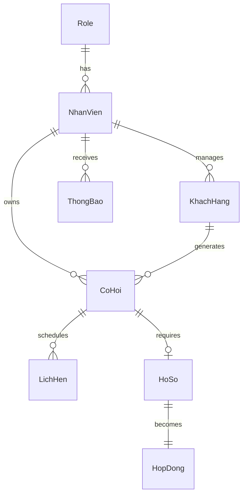
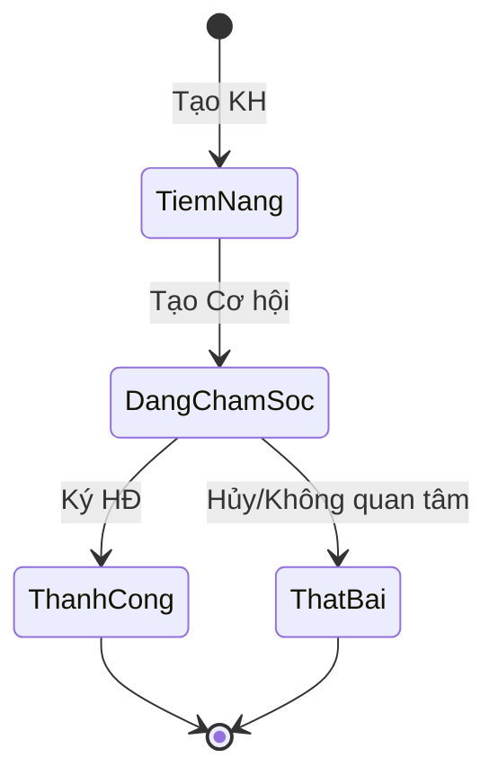
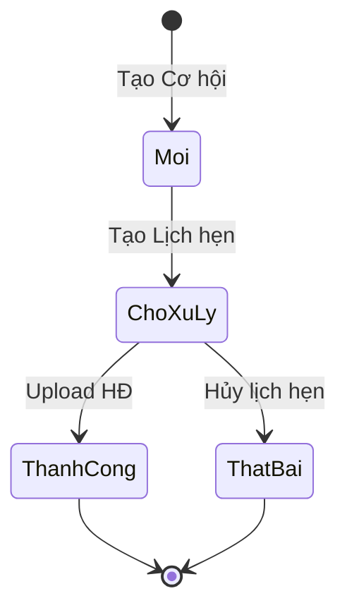

# HỆ THỐNG QUẢN LÝ KHÁCH HÀNG - CRM BIC HÀ NỘI

## 📋 TỔNG QUAN DỰ ÁN

### Mô tả
Website quản lý khách hàng nội bộ cho nhân viên kinh doanh bảo hiểm Chi nhánh BIC Hà Nội. Số hóa quy trình chăm sóc khách hàng, quản lý cơ hội bán hàng, theo dõi hợp đồng và báo cáo KPI.

### Mục tiêu
- Số hóa quy trình chăm sóc KH từ tiềm năng → chốt hợp đồng
- Tăng hiệu quả bán hàng thông qua quản lý cơ hội và lịch hẹn
- Quản lý tập trung, minh bạch với phân quyền rõ ràng
- Báo cáo KPI realtime, hỗ trợ ra quyết định nhanh

### Phạm vi chức năng
**6 Module chính:**
1. **Quản lý Khách hàng** - CRUD KH cá nhân/doanh nghiệp
2. **Quản lý Cơ hội** - Theo dõi cơ hội bán hàng
3. **Quản lý Lịch hẹn** - Lên lịch và ghi nhận kết quả
4. **Quản lý Tài liệu** - Upload/duyệt hồ sơ & hợp đồng
5. **Báo cáo & KPI** - Thống kê doanh thu, hiệu suất
6. **Quản trị** - Quản lý nhân viên, phân quyền

### Người dùng
- **Nhân viên** (Role 1): CRUD own KH/Cơ hội/Lịch hẹn, view own KPI
- **Quản lý** (Role 2): View/Edit all, approve hồ sơ, manage users
- **Ban giám đốc** (Role 3): Toàn quyền + báo cáo tổng hợp

---

## 🛠 TECH STACK

### Backend
- **Runtime**: Node.js v18+
- **Framework**: Express v4.18+
- **Database**: MySQL 8.0
- **Authentication**: JWT + bcryptjs (hash rounds=10)
- **File Upload**: Multer (local storage, no size limit)
- **Realtime**: Socket.IO v4
- **Cron Job**: node-cron (6:00 AM daily)
- **Validation**: express-validator
- **Others**: cors, dotenv

### Frontend
- **Framework**: React 18
- **UI Library**: Material-UI v5
- **State**: Context API (AuthContext, SocketContext)
- **HTTP Client**: Axios
- **Routing**: react-router-dom v6
- **Charts**: Recharts
- **Notifications**: react-toastify
- **Date**: dayjs

### Kiến trúc
```
┌─────────────┐         ┌──────────────┐         ┌──────────┐
│   React     │  HTTP   │   Express    │  SQL    │  MySQL   │
│  (Client)   │ ◄─────► │  (Server)    │ ◄─────► │   DB     │
│   :3000     │         │    :5000     │         │  :3306   │
└─────────────┘         └──────────────┘         └──────────┘
       │                        │
       └────── Socket.IO ───────┘
       
3-Tier: Presentation → Business Logic → Data Access
Pattern: MVC (Model-View-Controller)
```

### Environment Variables
```bash
# Backend .env
DB_HOST=localhost
DB_USER=root
DB_PASSWORD=your_password
DB_NAME=crm_bic
JWT_SECRET=your_32_char_minimum_secret_key_here
PORT=5000
NODE_ENV=development

# Frontend .env
REACT_APP_API_URL=http://localhost:5000
```

---

## 🗄 DATABASE SCHEMA

### ERD Mermaid Diagram


### SQL Schema

```sql
-- 1. Role
CREATE TABLE Role (
    ID INT PRIMARY KEY AUTO_INCREMENT,
    TenRole VARCHAR(50) NOT NULL UNIQUE,
    Mota TEXT
);

INSERT INTO Role (TenRole, Mota) VALUES 
('Nhân viên', 'Nhân viên kinh doanh'),
('Quản lý', 'Quản lý chi nhánh'),
('Ban giám đốc', 'Ban giám đốc');

-- 2. NhanVien
CREATE TABLE NhanVien (
    ID INT PRIMARY KEY AUTO_INCREMENT,
    ID_Role INT NOT NULL,
    TenNhanVien VARCHAR(100) NOT NULL,
    CCCD VARCHAR(20),
    DiemThuong INT DEFAULT 0,
    Email VARCHAR(100),
    Username VARCHAR(50) NOT NULL UNIQUE,
    MatKhau VARCHAR(255) NOT NULL,
    TrangThaiNhanVien ENUM('Hoạt động', 'Khóa') DEFAULT 'Hoạt động',
    createdAt TIMESTAMP DEFAULT CURRENT_TIMESTAMP,
    updatedAt TIMESTAMP DEFAULT CURRENT_TIMESTAMP ON UPDATE CURRENT_TIMESTAMP,
    FOREIGN KEY (ID_Role) REFERENCES Role(ID),
    INDEX idx_role (ID_Role),
    INDEX idx_status (TrangThaiNhanVien)
);

-- 3. KhachHang
CREATE TABLE KhachHang (
    ID INT PRIMARY KEY AUTO_INCREMENT,
    ID_NhanVien INT NOT NULL,
    TenKhachHang VARCHAR(100),
    TenDoanhNghiep VARCHAR(200),
    LoaiKhachHang ENUM('Cá nhân', 'Doanh nghiệp') NOT NULL,
    NgayTao DATETIME DEFAULT CURRENT_TIMESTAMP,
    SoDienThoai VARCHAR(15),
    Email VARCHAR(100),
    DiaChi TEXT,
    TrangThaiKhachHang ENUM('Tiềm năng', 'Đang chăm sóc', 'Thành công', 'Rời bỏ', 'Không tiềm năng') DEFAULT 'Tiềm năng',
    GhiChu TEXT,
    FOREIGN KEY (ID_NhanVien) REFERENCES NhanVien(ID) ON DELETE CASCADE,
    INDEX idx_nhanvien (ID_NhanVien),
    INDEX idx_status (TrangThaiKhachHang),
    INDEX idx_loai (LoaiKhachHang)
);

-- 4. CoHoi
CREATE TABLE CoHoi (
    ID INT PRIMARY KEY AUTO_INCREMENT,
    ID_KhachHang INT NOT NULL,
    ID_NhanVien INT NOT NULL,
    TenCoHoi VARCHAR(200) NOT NULL,
    TrangThaiCoHoi ENUM('Mới', 'Chờ xử lý', 'Thành công', 'Thất bại') DEFAULT 'Mới',
    GiaTri DECIMAL(15,2),
    NgayTao DATETIME DEFAULT CURRENT_TIMESTAMP,
    GhiChu TEXT,
    FOREIGN KEY (ID_KhachHang) REFERENCES KhachHang(ID) ON DELETE CASCADE,
    FOREIGN KEY (ID_NhanVien) REFERENCES NhanVien(ID),
    INDEX idx_kh (ID_KhachHang),
    INDEX idx_nv (ID_NhanVien),
    INDEX idx_status (TrangThaiCoHoi),
    INDEX idx_composite (TrangThaiCoHoi, NgayTao)
);

-- 5. LichHen
CREATE TABLE LichHen (
    ID INT PRIMARY KEY AUTO_INCREMENT,
    ID_CoHoi INT NOT NULL,
    ThoiGianHen DATETIME NOT NULL,
    DiaDiem VARCHAR(200),
    NoiDung TEXT,
    KetQuaSauCuocHen TEXT,
    TrangThaiLichHen ENUM('Sắp diễn ra', 'Hoàn thành', 'Hủy', 'Quá hạn') DEFAULT 'Sắp diễn ra',
    FOREIGN KEY (ID_CoHoi) REFERENCES CoHoi(ID) ON DELETE CASCADE,
    INDEX idx_cohoi (ID_CoHoi),
    INDEX idx_time (ThoiGianHen),
    INDEX idx_status (TrangThaiLichHen)
);

-- 6. HoSo
CREATE TABLE HoSo (
    ID INT PRIMARY KEY AUTO_INCREMENT,
    ID_CoHoi INT NOT NULL,
    TenHoSo VARCHAR(200) NOT NULL,
    FileHoSo VARCHAR(500) NOT NULL,
    TrangThaiHoSo ENUM('Chờ duyệt', 'Đã duyệt', 'Bổ sung') DEFAULT 'Chờ duyệt',
    NgayUpload DATETIME DEFAULT CURRENT_TIMESTAMP,
    NgayDuyet DATETIME,
    GhiChu TEXT,
    FOREIGN KEY (ID_CoHoi) REFERENCES CoHoi(ID) ON DELETE CASCADE,
    INDEX idx_cohoi (ID_CoHoi),
    INDEX idx_status (TrangThaiHoSo)
);

-- 7. HopDong
CREATE TABLE HopDong (
    ID INT PRIMARY KEY AUTO_INCREMENT,
    ID_HoSo INT NOT NULL,
    MaHopDong VARCHAR(50) UNIQUE NOT NULL,
    NgayHieuLuc DATE NOT NULL,
    NgayHetHan DATE NOT NULL,
    GiaTri DECIMAL(15,2) NOT NULL,
    FileHopDong VARCHAR(500),
    FOREIGN KEY (ID_HoSo) REFERENCES HoSo(ID) ON DELETE CASCADE,
    INDEX idx_hoso (ID_HoSo),
    INDEX idx_expiry (NgayHetHan)
);

-- 8. ThongBao
CREATE TABLE ThongBao (
    ID INT PRIMARY KEY AUTO_INCREMENT,
    ID_NhanVien INT NOT NULL,
    LoaiThongBao ENUM('Lịch hẹn', 'Tái tục', 'Hồ sơ') NOT NULL,
    NoiDung TEXT NOT NULL,
    TrangThai ENUM('Chưa đọc', 'Đã đọc') DEFAULT 'Chưa đọc',
    NgayTao DATETIME DEFAULT CURRENT_TIMESTAMP,
    FOREIGN KEY (ID_NhanVien) REFERENCES NhanVien(ID) ON DELETE CASCADE,
    INDEX idx_nv (ID_NhanVien),
    INDEX idx_status (TrangThai),
    INDEX idx_created (NgayTao)
);
```

---

## 🔄 BUSINESS LOGIC & STATE MACHINE

### Sơ đồ Luồng Dữ liệu (DFD) Mức Đỉnh

Hệ thống CRM bao gồm **6 processes chính**:

1. **Quản lý Khách hàng**
   - Input: Thông tin KH từ Nhân viên
   - Output: Danh sách KH, Đề nghị không lên khách hàng
   - Data store: KhachHang

2. **Quản lý Cơ hội**
   - Input: Danh sách & chi tiết KH, Yêu cầu xem cơ hội
   - Output: Đánh giá nhu cầu, Kết quả xử lý
   - Data store: CoHoi

3. **Quản lý Lịch hẹn**
   - Input: Thông tin cơ hội, Yêu cầu xem lịch hẹn
   - Output: Đánh sách & kết quả lịch hẹn, Thông tin cơ hội
   - Data store: LichHen

4. **Quản lý Tài liệu**
   - Input: Danh sách hồ sơ & kết quả xử lý, Cánh sách hợp đồng
   - Output: Dữ liệu hồ sơ và báo hiểm
   - Data store: HoSo, HopDong

5. **Báo cáo**
   - Input: Yêu cầu xem báo cáo, Dữ liệu tài khoản nhân viên
   - Output: Báo cáo doanh thu, Báo cáo tỷ lệ chuyển đổi, Hợp đồng gần đến hạn
   - External: Ban giám đốc

6. **Quản trị**
   - Input: Yêu cầu xem tài khoản, Thông tin tài khoản cập nhật
   - Output: Cập nhật quyền tài khoản, Thông tin tài khoản
   - Data store: NhanVien, Role

### Luồng nghiệp vụ chi tiết

#### 1. Quy trình Thêm mới Khách hàng
```
[Nhân viên] Tiếp nhận nguồn thông tin KH
    ↓
Thêm mới thông tin KH (TenKhachHang, LoaiKhachHang, SDT, Email, DiaChi)
    ↓
[Hệ thống] Lưu thông tin KH vào Database
    ↓
Tự động set: TrangThaiKhachHang = 'Tiềm năng'
              ID_NhanVien = req.user.userId
    ↓
[Kết thúc] KH được tạo với trạng thái "Tiềm năng"
```

#### 2. Quy trình Quản lý Cơ hội (Chi tiết 27 bước theo Swimlane Diagram)

**Phase 1: Tạo Cơ hội**
```
1. [User] Tìm kiếm thông tin KH
2. [System] Trả tích hợp thông tin KH trong ứng dụng
3. [User] Tạo cơ hội kinh doanh với KH
4. [System] Lưu thông tin cơ hội, lưu hồ sơ trang thái "Đang chăm sóc", "Trạng thái cơ hội: Mới"
   - INSERT CoHoi (TrangThai='Mới', ID_KhachHang, ID_NhanVien)
   - UPDATE KhachHang SET TrangThai='Đang chăm sóc'
```

**Phase 2: Lịch hẹn**
```
5. [User] Tạo lịch hẹn mới với KH
6. [System] Lưu thông tin lịch hẹn, trạng thái "Sắp diễn ra", cơ hội "Chờ xử lý"
   - INSERT LichHen (TrangThai='Sắp diễn ra')
   - UPDATE CoHoi SET TrangThai='Chờ xử lý'
   - Socket.IO emit 'new-appointment'

7. [Decision] KH ĐẾN HẸN?
   - Không → Step 8: Cập nhật trạng thái lịch hẹn "Hủy"
           → Step 9: Lưu thông tin lịch hẹn, trạng thái "Hủy"
           - UPDATE LichHen SET TrangThai='Hủy'
           - UPDATE CoHoi SET TrangThai='Thất bại'
           → [Kết thúc]
   
   - Có → Step 10: Cho biết kết quả lịch hẹn, trạng thái "Hoàn thành"
        → Step 11: [Decision] KẾT QUẢ HẸN KỸ ĐƯỢC?
```

**Phase 3: Xử lý kết quả hẹn**
```
11a. Không (Thất bại) 
    → Step 12: Lưu kết quả hẹn, Cơ hội "Thất bại"
        - UPDATE LichHen SET TrangThai='Hoàn thành', KetQuaSauCuocHen='Thất bại'
        - UPDATE CoHoi SET TrangThai='Thất bại'
    
    → Step 13: [AUTO] Đánh giá lại Khách hàng (Churn Prediction Logic)
        - Kiểm tra: KH đã từng có Hợp đồng thành công chưa?
        
        CASE 1 (Đã từng mua - có hợp đồng cũ):
            IF EXISTS (SELECT 1 FROM HopDong hd 
                       JOIN HoSo hs ON hd.ID_HoSo = hs.ID 
                       JOIN CoHoi co ON hs.ID_CoHoi = co.ID 
                       WHERE co.ID_KhachHang = :khachHangId) THEN
                -- Kiểm tra tất cả HĐ cũ đã hết hạn chưa
                IF (Tất cả HĐ đã hết hạn: NgayHetHan < CURDATE()) THEN 
                    UPDATE KhachHang SET TrangThai = 'Rời bỏ'
                END IF
            END IF
        
        CASE 2 (Chưa từng mua - không có hợp đồng nào):
            ELSE
                -- Kiểm tra không còn cơ hội nào đang mở
                IF (Không còn CoHoi với TrangThai IN ('Mới', 'Chờ xử lý')) THEN
                    UPDATE KhachHang SET TrangThai = 'Không tiềm năng'
                END IF
            END ELSE
        
    → [Kết thúc quy trình]

11b. Có (Thành công) → Step 14: Yêu cầu bổ sung thêm thông tin "Đối tượng được bảo hiểm"
         → Step 14: Cho nội dung từ người thân "Người được bảo hiểm"
         → Step 15: Thành lập → Step 16: Lưu kết quả hẹn, Cơ hội "Thành công"
```

**Phase 4: Upload & Duyệt Hồ sơ**
```
17. [User] Upload file hồ sơ
18. [System] Lưu truy cập vòng thông tài liệu "Hồ sơ bảo hiểm" chờ duyệt
    - INSERT HoSo (TrangThai='Chờ duyệt', FileHoSo)

19. [Quản lý] Lưu kết quả phản hồi từ khách hàng
20. [Decision] Upload file hồ sơ nào?
    - Sai → Step 21: Lưu trạng thái "Chờ duyệt", chỗ yêu cầu hồ sơ khách phải điều chỉnh lại
          - UPDATE HoSo SET TrangThai='Bổ sung', GhiChu='lý do'
          → Back to Step 17
    
    - Đúng → Step 22: Thay lý do hồ sơ chờ duyệt

23. [Decision] Duyệt?
    - Không → Step 24: Cập nhật lưu kết quả Chờ hồ sơ hợp lý nộp khách hàng
            - UPDATE HoSo SET TrangThai='Bổ sung'
            → Back to Step 17
    
    - Có → Step 25: Lưu trạng thái duyệt, cánh sách trạng thái hợp đồng cơ hội KH
         - UPDATE HoSo SET TrangThai='Đã duyệt', NgayDuyet=NOW()
         - Socket.IO emit 'hoso-approved'
```

**Phase 5: Hoàn tất Hợp đồng**
```
26. [User] Upload hợp đồng (file PDF/DOC)
    - [VALIDATION]: Hệ thống kiểm tra điều kiện:
        const hoSo = await HoSo.findById(req.body.ID_HoSo);
        IF (hoSo.TrangThaiHoSo != 'Đã duyệt') THEN 
            → Báo lỗi "Hồ sơ chưa được duyệt, không thể tạo hợp đồng"
            → [Kết thúc - Lỗi]
        END IF

27. [System] Lưu truy cập vòng thông thái "Hợp đồng", trạng thái cơ hội "Thành công"
    - INSERT HopDong (ID_HoSo, MaHopDong, NgayHieuLuc, NgayHetHan, GiaTri, FileHopDong)
    - UPDATE CoHoi SET TrangThai='Thành công'
    - UPDATE KhachHang SET TrangThai='Thành công'
    → [Kết thúc - Thành công]
```

#### 3. Quy trình Nhắc Tái tục (Activity Diagram)

**Automated Process - Daily at 6:00 AM**

```
[Hệ thống] Kiểm tra thời hạn hợp đồng =< 30 ngày
    ↓
[System] Query: SELECT * FROM HopDong h
                JOIN CoHoi c ON h.ID_HoSo = c.ID_HoSo
                JOIN NhanVien nv ON c.ID_NhanVien = nv.ID
                WHERE DATEDIFF(h.NgayHetHan, CURDATE()) BETWEEN 0 AND 30
    ↓
[Decision] Có hợp đồng sắp hết hạn?
    ↓ (Có)
Gửi thông báo tái tục đến nhân viên phụ trách
    ↓
[System] FOR EACH expiring contract:
    - INSERT INTO ThongBao (
        ID_NhanVien = nv.ID,
        LoaiThongBao = 'Tái tục',
        NoiDung = 'Hợp đồng {MaHopDong} của KH {TenKhachHang} sẽ hết hạn vào {NgayHetHan}',
        TrangThai = 'Chưa đọc',
        NgayTao = NOW()
      )
    ↓
[Socket.IO] Realtime notification to user
    - io.to('user_' + ID_NhanVien).emit('notification', {
        type: 'renewal',
        title: 'Nhắc tái tục hợp đồng',
        message: notificationContent,
        contractId: h.ID,
        customerId: c.ID_KhachHang
      })
    ↓
[User] Quy trình quản lý cơ hội (tạo cơ hội mới cho tái tục)
    ↓
[Kết thúc]
```

**Implementation Note:**
```javascript
// Cron job in server.js
const cron = require('node-cron');

cron.schedule('0 6 * * *', async () => {
  const [contracts] = await db.query(`
    SELECT h.*, c.ID_NhanVien, c.ID_KhachHang, kh.TenKhachHang 
    FROM HopDong h
    JOIN HoSo hs ON h.ID_HoSo = hs.ID
    JOIN CoHoi c ON hs.ID_CoHoi = c.ID
    JOIN KhachHang kh ON c.ID_KhachHang = kh.ID
    WHERE DATEDIFF(h.NgayHetHan, CURDATE()) BETWEEN 0 AND 30
  `);
  
  for (const contract of contracts) {
    const message = `Hợp đồng ${contract.MaHopDong} của KH ${contract.TenKhachHang} sẽ hết hạn vào ${contract.NgayHetHan}`;
    
    await db.query(
      'INSERT INTO ThongBao (ID_NhanVien, LoaiThongBao, NoiDung) VALUES (?, ?, ?)',
      [contract.ID_NhanVien, 'Tái tục', message]
    );
    
    io.to('user_' + contract.ID_NhanVien).emit('notification', {
      type: 'renewal',
      message,
      contractId: contract.ID
    });
  }
});
```

### State Transition Diagrams





---

## 🔌 API ENDPOINTS

### 1. Authentication
**POST /api/auth/login**
- Body: `{username, password}`
- Response: `{success, token, user: {id, username, roleId, roleName}}`
- Example:
```javascript
fetch('/api/auth/login', {
  method: 'POST',
  headers: {'Content-Type': 'application/json'},
  body: JSON.stringify({username: 'admin', password: 'password'})
})
```

**POST /api/auth/change-password**
- Auth: Required
- Body: `{oldPassword, newPassword}`
- Response: `{success, message}`

### 2. Khách hàng
**GET /api/khachhang**
- Auth: Required
- Query: `?search=&trangThai=&loai=&page=1&limit=20`
- Role filter: Nhân viên (WHERE ID_NhanVien=userId), Quản lý (all)
- Response: `{success, data: [], total, page, totalPages}`

**POST /api/khachhang**
- Auth: Required
- Body: `{TenKhachHang/TenDoanhNghiep, LoaiKhachHang, SoDienThoai, Email, DiaChi, GhiChu}`
- Auto set: `ID_NhanVien=req.user.userId, TrangThai='Tiềm năng'`

**PUT /api/khachhang/:id**
- Auth: Required
- Check: Ownership (Nhân viên) or Manager role
- Body: Same as POST

**GET /api/khachhang/:id**
- Include: CoHoi[], LichHen[] history

**DELETE /api/khachhang/:id**
- CASCADE delete CoHoi, LichHen, HoSo, HopDong

### 3. Cơ hội
**POST /api/cohoi**
- Body: `{ID_KhachHang, TenCoHoi, GiaTri, GhiChu}`
- Trigger: UPDATE KhachHang SET TrangThai='Đang chăm sóc'

**PUT /api/cohoi/:id/status**
- Body: `{TrangThai, GhiChu}`
- Validate: State transition rules

### 4. Lịch hẹn
**POST /api/lichhen**
- Body: `{ID_CoHoi, ThoiGianHen, DiaDiem, NoiDung}`
- Trigger: UPDATE CoHoi TrangThai='Chờ xử lý'
- Socket: emit 'new-appointment' to user

**PUT /api/lichhen/:id/complete**
- Body: `{KetQuaSauCuocHen, isSuccess}`
- Update: TrangThai='Hoàn thành'
- If fail: UPDATE CoHoi TrangThai='Thất bại'

**PUT /api/lichhen/:id/cancel**
- Update: TrangThai='Hủy'
- Trigger: UPDATE CoHoi TrangThai='Thất bại'

**GET /api/lichhen/today**
- WHERE: DATE(ThoiGianHen)=CURDATE() AND ID_NhanVien filter

### 5. Hồ sơ
**POST /api/hoso**
- Multer: Upload to ./uploads/hoso/
- Body: FormData {ID_CoHoi, TenHoSo, file}
- Save: filename = timestamp + originalname

**PUT /api/hoso/:id/approve**
- Role: Manager only
- Update: TrangThai='Đã duyệt', NgayDuyet=NOW()
- Socket: emit 'hoso-approved'

**PUT /api/hoso/:id/reject**
- Role: Manager only
- Body: `{GhiChu}`
- Update: TrangThai='Bổ sung'

**GET /api/hoso/download/:id**
- Check: Authorization (own or manager)
- Response: res.download(filepath)

### 6. Hợp đồng
**POST /api/hopdong**
- Validate: HoSo must be 'Đã duyệt'
- Body: FormData {ID_HoSo, MaHopDong, NgayHieuLuc, NgayHetHan, GiaTri, file}
- Trigger: UPDATE CoHoi='Thành công', KhachHang='Thành công'

**GET /api/hopdong/expiring**
- WHERE: DATEDIFF(NgayHetHan, CURDATE()) <= 30

### 7. Báo cáo
**GET /api/baocao/doanhthu**
- Query: `?startDate=&endDate=&nhanvienId=`
- SQL: `SUM(GiaTri) FROM HopDong WHERE NgayHieuLuc BETWEEN ? AND ? GROUP BY MONTH, YEAR`

**GET /api/baocao/kpi/:nhanvienId**
- Return: `{khMoi: {actual, target: 10}, coHoiThanhCong: {actual, target: 5}, doanhThu: {actual, target: 100000000}}`

**GET /api/baocao/top-nhanvien**
- SQL: `SELECT ID_NhanVien, SUM(GiaTri) as total FROM HopDong GROUP BY ID_NhanVien ORDER BY total DESC LIMIT 10`

**POST /api/baocao/export**
- Body: `{type: 'excel'|'pdf', startDate, endDate}`
- Library: exceljs / pdfkit
- Response: File download

### 8. Quản lý
**POST /api/quanly/nhanvien**
- Role: Manager only
- Body: `{TenNhanVien, Username, Password, Email, ID_Role}`
- Hash: bcrypt password before insert

**GET /api/quanly/hoso/pending**
- WHERE: TrangThai='Chờ duyệt'

**GET /api/quanly/lichhen/overdue**
- WHERE: ThoiGianHen < NOW() AND TrangThai='Sắp diễn ra'

### 9. Thông báo
**GET /api/thongbao**
- WHERE: ID_NhanVien=userId
- Order: NgayTao DESC

**PUT /api/thongbao/:id/read**
- UPDATE: TrangThai='Đã đọc'

---

## 🔐 AUTHENTICATION & AUTHORIZATION

### JWT Flow
```javascript
// Login
const token = jwt.sign(
  {userId: user.ID, roleId: user.ID_Role, username: user.Username},
  process.env.JWT_SECRET,
  {expiresIn: '24h'}
);

// Middleware
const authMiddleware = (req, res, next) => {
  const token = req.headers.authorization?.split(' ')[1];
  const decoded = jwt.verify(token, process.env.JWT_SECRET);
  req.user = decoded;
  next();
};

// Role check
const roleMiddleware = (allowedRoles) => (req, res, next) => {
  if (!allowedRoles.includes(req.user.roleId)) {
    return res.status(403).json({success: false, message: 'Forbidden'});
  }
  next();
};
```

### RBAC Rules
| Role | Permissions |
|------|-------------|
| Nhân viên (1) | CRUD own KH/CoHoi/LichHen (WHERE ID_NhanVien=userId), View own KPI, Upload HoSo |
| Quản lý (2) | View/Edit ALL data, Approve/Reject HoSo, Manage NhanVien, View all KPI |
| Ban giám đốc (3) | Full access (inherit Quản lý + special reports) |

---

## 📁 FILE UPLOAD STRATEGY

### Multer Config
```javascript
const multer = require('multer');
const path = require('path');

const storage = multer.diskStorage({
  destination: (req, file, cb) => {
    const folder = req.baseUrl.includes('hoso') ? './uploads/hoso' : './uploads/hopdong';
    cb(null, folder);
  },
  filename: (req, file, cb) => {
    cb(null, Date.now() + '-' + file.originalname);
  }
});

const fileFilter = (req, file, cb) => {
  const allowed = ['.pdf', '.jpg', '.jpeg', '.png', '.doc', '.docx'];
  const ext = path.extname(file.originalname).toLowerCase();
  cb(null, allowed.includes(ext));
};

const upload = multer({storage, fileFilter});
```

### Security
- Validate MIME types (whitelist)
- Rename files (prevent execution)
- Store outside webroot
- Path traversal prevention: Never use user input directly in filepath

---

## ⚡ REALTIME NOTIFICATIONS

### Backend (socketService.js)
```javascript
const socketIO = require('socket.io');
const jwt = require('jsonwebtoken');

const setupSocket = (server) => {
  const io = socketIO(server, {cors: {origin: 'http://localhost:3000'}});
  
  io.use((socket, next) => {
    const token = socket.handshake.auth.token;
    const decoded = jwt.verify(token, process.env.JWT_SECRET);
    socket.userId = decoded.userId;
    next();
  });
  
  io.on('connection', (socket) => {
    socket.join('user_' + socket.userId);
  });
  
  return io;
};

// Usage in routes
io.to('user_' + ID_NhanVien).emit('notification', {
  type: 'new-appointment',
  message: 'Bạn có lịch hẹn mới',
  data: {...}
});
```

### Frontend (SocketContext.jsx)
```javascript
import io from 'socket.io-client';
import {createContext, useEffect, useState} from 'react';

export const SocketContext = createContext();

export const SocketProvider = ({children}) => {
  const [socket, setSocket] = useState(null);
  const [notifications, setNotifications] = useState([]);
  
  useEffect(() => {
    const token = localStorage.getItem('token');
    const newSocket = io('http://localhost:5000', {auth: {token}});
    
    newSocket.on('notification', (data) => {
      setNotifications(prev => [data, ...prev]);
      toast.info(data.message);
    });
    
    setSocket(newSocket);
    return () => newSocket.close();
  }, []);
  
  return (
    <SocketContext.Provider value={{socket, notifications}}>
      {children}
    </SocketContext.Provider>
  );
};
```

### Cron Job Integration
```javascript
const cron = require('node-cron');

// Daily at 6:00 AM
cron.schedule('0 6 * * *', async () => {
  const expiring = await db.query(
    'SELECT * FROM HopDong WHERE DATEDIFF(NgayHetHan, CURDATE()) BETWEEN 0 AND 30'
  );
  
  for (const hd of expiring) {
    await db.query('INSERT INTO ThongBao (ID_NhanVien, LoaiThongBao, NoiDung) VALUES (?, ?, ?)',
      [hd.ID_NhanVien, 'Tái tục', `Hợp đồng ${hd.MaHopDong} sẽ hết hạn ${hd.NgayHetHan}`]
    );
    
    io.to('user_' + hd.ID_NhanVien).emit('notification', {
      type: 'renewal',
      message: `Hợp đồng ${hd.MaHopDong} sắp hết hạn`
    });
  }
});
```

---

## 📊 KPI & REPORTING

### KPI Targets
```javascript
const KPI_TARGETS = {
  khachHangMoi: 10,      // 10 KH mới/tháng
  coHoiThanhCong: 5,     // 5 cơ hội thành công/tháng
  doanhThu: 100000000    // 100 triệu VNĐ/tháng
};

// Tính KPI %
const kpiPercent = (actual, target) => Math.round((actual / target) * 100);
```

### Báo cáo Doanh thu Query
```sql
SELECT 
  MONTH(NgayHieuLuc) as thang,
  YEAR(NgayHieuLuc) as nam,
  SUM(GiaTri) as tongDoanhThu,
  COUNT(*) as soHopDong
FROM HopDong
WHERE NgayHieuLuc BETWEEN ? AND ?
  AND ID_NhanVien = ? -- Optional: filter by staff
GROUP BY YEAR(NgayHieuLuc), MONTH(NgayHieuLuc)
ORDER BY nam DESC, thang DESC;
```

### Export Excel
```javascript
const ExcelJS = require('exceljs');

const exportExcel = async (data) => {
  const workbook = new ExcelJS.Workbook();
  const sheet = workbook.addWorksheet('Báo cáo');
  
  sheet.columns = [
    {header: 'Tháng', key: 'thang'},
    {header: 'Doanh thu', key: 'doanhThu'}
  ];
  
  sheet.addRows(data);
  
  const buffer = await workbook.xlsx.writeBuffer();
  res.setHeader('Content-Disposition', 'attachment; filename=baocao.xlsx');
  res.send(buffer);
};
```

---

## 🎨 FRONTEND STRUCTURE

### Folder Structure
```
client/
├── src/
│   ├── api/
│   │   └── axiosConfig.js          # Axios instance + interceptors
│   ├── context/
│   │   ├── AuthContext.jsx         # Login/logout/user state
│   │   └── SocketContext.jsx       # Socket.IO connection
│   ├── routes/
│   │   └── PrivateRoute.jsx        # Auth check wrapper
│   ├── components/
│   │   ├── Layout/
│   │   │   ├── Header.jsx          # Logo, User menu, Notification bell
│   │   │   ├── Sidebar.jsx         # Nav links by role
│   │   │   └── Footer.jsx
│   │   └── Shared/
│   │       ├── DataTable.jsx       # Reusable table with pagination
│   │       ├── FormInput.jsx       # MUI TextField wrapper
│   │       └── NotificationBell.jsx # Badge + Popover
│   └── pages/
│       ├── Login.jsx
│       ├── Dashboard.jsx           # Stats cards + charts
│       ├── KhachHang/
│       │   ├── List.jsx
│       │   ├── Create.jsx
│       │   ├── Edit.jsx
│       │   └── Detail.jsx          # Tabs: Info, CoHoi, LichHen
│       ├── CoHoi/
│       │   ├── List.jsx            # Kanban or Table view
│       │   └── Create.jsx
│       ├── LichHen/
│       │   ├── Calendar.jsx        # Calendar view
│       │   └── Create.jsx
│       ├── HoSo/
│       │   ├── List.jsx
│       │   ├── Upload.jsx
│       │   └── Approval.jsx        # Manager only
│       ├── HopDong/
│       │   └── List.jsx
│       ├── BaoCao/
│       │   └── Dashboard.jsx       # Charts + Export
│       └── QuanLy/
│           ├── NhanVien.jsx
│           └── HoSoPending.jsx
```

### AuthContext Example
```javascript
export const AuthContext = createContext();

export const AuthProvider = ({children}) => {
  const [user, setUser] = useState(null);
  
  const login = async (username, password) => {
    const res = await axios.post('/api/auth/login', {username, password});
    localStorage.setItem('token', res.data.token);
    setUser(res.data.user);
  };
  
  const logout = () => {
    localStorage.removeItem('token');
    setUser(null);
  };
  
  useEffect(() => {
    const token = localStorage.getItem('token');
    if (token) {
      const decoded = jwtDecode(token);
      setUser(decoded);
    }
  }, []);
  
  return (
    <AuthContext.Provider value={{user, login, logout}}>
      {children}
    </AuthContext.Provider>
  );
};
```

---

## 🚀 DEVELOPMENT SETUP

### Prerequisites
- Node.js v18+
- MySQL 8.0
- Git

### Backend Setup
```bash
cd backend
npm install
# Create .env (see Environment Variables section)
# Import database.sql to MySQL
npm run dev
```

### Frontend Setup
```bash
cd client
npm install
# Create .env with REACT_APP_API_URL=http://localhost:5000
npm start
```

### Database Setup
```bash
mysql -u root -p
CREATE DATABASE crm_bic;
USE crm_bic;
SOURCE database.sql;

# Insert default admin
INSERT INTO NhanVien (ID_Role, TenNhanVien, Username, MatKhau) 
VALUES (3, 'Admin', 'admin', '$2a$10$hashed_password');
```

---

## 🔒 SECURITY BEST PRACTICES

1. **JWT**: Min 32 chars secret, 24h expiration
2. **Passwords**: bcrypt rounds=10, min 8 chars
3. **Input Validation**: express-validator on all inputs
4. **SQL Injection**: Always use parameterized queries
5. **XSS**: Sanitize HTML inputs
6. **CORS**: Whitelist frontend origin only
7. **File Upload**: Validate MIME types, rename files
8. **Rate Limiting**: Apply on /api/auth/* endpoints
9. **HTTPS**: Force SSL in production

---

## ⚡ PERFORMANCE OPTIMIZATION

### Database
- Index on FK columns: ID_NhanVien, ID_KhachHang, ID_CoHoi
- Composite index: (TrangThai, NgayTao)
- Connection pooling: mysql2 pool size=10
- Pagination: Default limit=20, max=100

### Backend
- Compression middleware (gzip)
- Caching (node-cache for roles)
- Async/await proper usage

### Frontend
- Code splitting: React.lazy + Suspense
- Memoization: React.memo, useMemo, useCallback
- Virtual scrolling for large lists

**Target**: API < 500ms, Page load < 3s

---

## 📝 APPENDIX: CODE TEMPLATES

### Backend Controller Template
```javascript
const asyncHandler = require('express-async-handler');

exports.getAll = asyncHandler(async (req, res) => {
  const {page = 1, limit = 20} = req.query;
  const offset = (page - 1) * limit;
  
  const [rows] = await db.query(
    'SELECT * FROM Table WHERE ID_NhanVien=? LIMIT ? OFFSET ?',
    [req.user.userId, parseInt(limit), offset]
  );
  
  const [total] = await db.query('SELECT COUNT(*) as count FROM Table WHERE ID_NhanVien=?', [req.user.userId]);
  
  res.json({
    success: true,
    data: rows,
    total: total[0].count,
    page: parseInt(page),
    totalPages: Math.ceil(total[0].count / limit)
  });
});
```

### Frontend Custom Hook
```javascript
const useFetch = (url) => {
  const [data, setData] = useState(null);
  const [loading, setLoading] = useState(true);
  const [error, setError] = useState(null);
  
  useEffect(() => {
    axios.get(url)
      .then(res => setData(res.data.data))
      .catch(err => setError(err))
      .finally(() => setLoading(false));
  }, [url]);
  
  return {data, loading, error};
};
```

### Utilities
```javascript
// Date formatter
const formatDate = (date) => dayjs(date).format('DD/MM/YYYY');

// Currency formatter
const formatCurrency = (amount) => 
  new Intl.NumberFormat('vi-VN', {style: 'currency', currency: 'VND'}).format(amount);

// Response helpers
const success = (res, data) => res.json({success: true, data});
const error = (res, message, code = 400) => res.status(code).json({success: false, message});
```

---

## 📌 DEPLOYMENT CHECKLIST

- [ ] Change JWT_SECRET to strong random key (min 32 chars)
- [ ] Set NODE_ENV=production
- [ ] Enable HTTPS (SSL certificate)
- [ ] Set CORS whitelist to production domain
- [ ] Create DB user with limited privileges (no DROP)
- [ ] Setup PM2 for backend auto-restart
- [ ] Setup nginx for frontend static files
- [ ] Configure ./uploads folder permissions (755)
- [ ] Setup database backup strategy (daily mysqldump)
- [ ] Enable SQL injection prevention (parameterized queries)
- [ ] Test all RBAC rules
- [ ] Test state machine transitions
- [ ] Test file upload/download
- [ ] Test realtime notifications
- [ ] Verify KPI calculations accuracy

---

**Document Version**: 1.0  
**Last Updated**: November 27, 2025  
**Tech Stack**: Node.js + React + MySQL + Socket.IO  
**Target**: CRM BIC Hà Nội - Chi nhánh Bảo hiểm

*Ready for implementation. All critical paths covered.* 🚀
